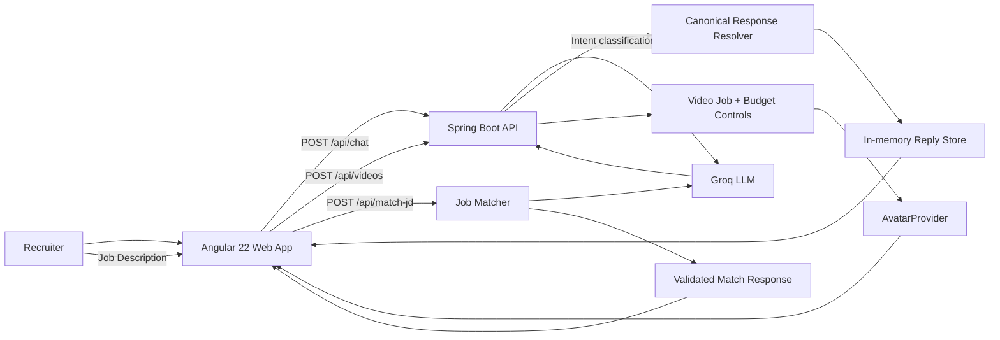
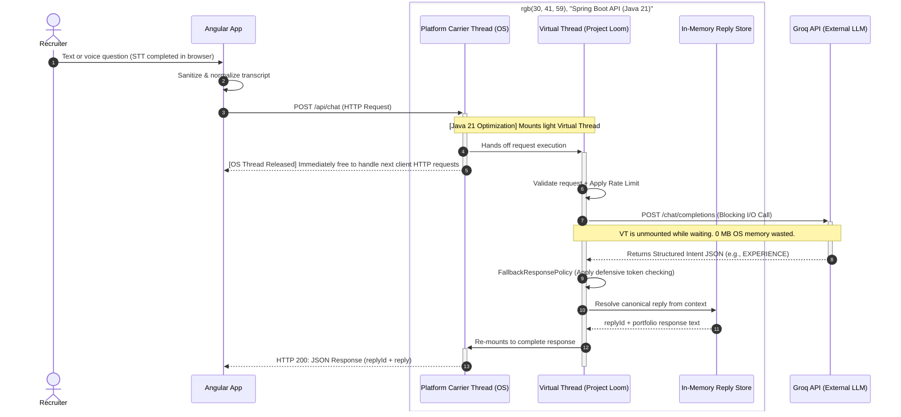

# AvatarRelay Showcase

> **An AI digital twin portfolio system built to demonstrate backend engineering, AI integration, reliability, and recruiter-focused UX.**

[](https://www.oracle.com/java/)
[](https://spring.io/projects/spring-boot)
[](https://angular.dev/)
[](https://www.typescriptlang.org/)
[](https://groq.com/)

## Source code and IP

The production source repository is intentionally **private** to protect implementation IP.

This showcase repository exposes the engineering story without publishing the full codebase: architecture, API boundaries, Mermaid diagrams, reliability decisions, testing strategy, and the live product.

**Private source repository:** https://github.com/OrenVilderman/avatar-relay

Source access can be provided to hiring managers and engineering interviewers on request.

## Executive overview

AvatarRelay is a recruiter-facing AI digital twin for Oren Vilderman's backend engineering portfolio.

A recruiter can:

- Ask questions by text or voice in English or Hebrew.
- Receive CV-grounded answers through a deterministic response layer.
- Hear the response through the avatar experience.
- Paste a real Job Description and receive a structured comparison against the candidate's documented experience.
- Move directly from technical exploration to contact actions such as scheduling a call or viewing the CV.

The engineering focus is deliberately broader than "calling an LLM":

- bounded model responsibility
- deterministic response resolution
- malformed-response recovery
- retry and fallback behavior
- prompt-injection boundaries
- server-owned video content
- safe error handling
- failure-oriented automated testing
- bilingual voice UX

## Live demo

**Live application:** https://avatar-relay.netlify.app/

**GitHub profile:** https://github.com/OrenVilderman

**LinkedIn:** https://linkedin.com/in/oren-vilderman

## Architecture at a glance

The current product uses one Spring Boot backend rather than introducing distributed infrastructure without a measured need.



### Chat + avatar sequence



## Key engineering features

### 1. Bilingual voice UX

The frontend uses the browser Web Speech API for voice input.

The voice path is designed around real browser speech-recognition failure modes rather than assuming a clean transcript:

- English and Hebrew input.
- Continuous recognition with interim results.
- Silence-based automatic submission.
- Generation guards to prevent stale recognition instances from updating current state.
- Safe fallback behavior for empty, noisy, or unusable speech transcripts.
- Transport failures degrade to a useful local response instead of exposing raw API errors.

The goal is a voice interaction that remains predictable even when speech recognition is imperfect.

### 2. High-throughput I/O concurrency (Java 21 Virtual Threads)
The backend architecture scales per-instance concurrency efficiently under I/O-heavy workloads by utilizing Java 21 Virtual Threads (`spring.threads.virtual.enabled=true`).
- Rather than tying up heavy operating-system platform threads (which consume ~1MB each) while waiting for slow external AI API calls (Groq), the application immediately unmounts the virtual thread during the blocking network I/O window.
- This decouples the concurrent request capacity from the server's raw memory limitations, allowing the production deployment to handle high-concurrency recruiter chat flows cleanly on resource-constrained cloud infrastructure (Render instances capped at 512MB RAM).

### 3. Bounded LLM responsibility

The model is intentionally not the source of truth for the candidate's profile.

```text
User input
   -> LLM classification / structured analysis
   -> validated application-level result
   -> deterministic application response
```

For recruiter chat, the LLM classifies intent while the application resolves the final response from controlled candidate information.

For Job Matcher, the model analyzes the Job Description but the CV remains the trusted source for claims about Oren's skills and experience.

### 4. Job Matcher resilience

Recruiter Job Descriptions are untrusted and often long, messy, or unexpectedly formatted.

The recovery strategy is staged:

```text
full JD
  -> Unicode normalization
  -> primary model
  -> bounded retry
  -> fallback model
  -> bounded retry
  -> high-signal JD compaction when needed
  -> model cascade again
  -> deterministic local fallback
```

The application validates the response envelope before accepting it:

```json
{
  "category": "JOB_MATCH | TECHNICAL_QA | WITTY_FALLBACK",
  "language": "he | en",
  "headline": "Short title",
  "matchScore": 0,
  "summary": "Validated response text",
  "highlights": ["point 1", "point 2"],
  "cta": {
    "text": "Deterministic presentation text",
    "action": "schedule_video | schedule_phone | view_cv"
  }
}
```

Invalid categories, invalid CTA actions, malformed JSON, empty model responses, missing fields, or invalid scores are recovery events rather than silently accepted data.

### 5. Server-owned avatar text

The browser does not submit arbitrary video text.

The frontend submits a server-generated `replyId`, and the backend resolves the canonical response before creating the video job.

This keeps the avatar layer aligned with the same controlled response that was shown to the recruiter.

### 6. Failure-aware integrations

External providers are treated as unreliable infrastructure.

Handled failure classes include:

- transport errors
- 4xx / 5xx responses
- empty successful HTTP bodies
- malformed JSON
- missing response fields
- empty `choices`
- unexpected enum values
- truncated model output
- rate limiting
- temporary provider failures

The application uses bounded retries, fallback models, validation and deterministic degradation where appropriate.

### 7. Testing rigor

Testing is designed around the actual failure surface, not only the happy path.

Coverage areas include:

- request validation
- structured LLM response parsing
- empty and malformed upstream responses
- retry and fallback behavior
- long Job Descriptions
- Job Matcher validation
- bilingual behavior
- voice interaction state transitions
- transport-failure degradation
- server-owned reply/video mapping
- provider isolation
- rate limiting and error contracts

Automated tests do not depend on live Groq or live D-ID execution. The avatar provider is mock-first, and real D-ID execution is intentionally frozen.

> Test status is intentionally not inferred from README counts. Current pass/fail status should be taken from the exact local test run or CI result for the commit being evaluated.

## API surface

| Method | Endpoint | Purpose |
|---|---|---|
| `POST` | `/api/chat` | Validate and classify a recruiter question, then return a canonical response and `replyId`. |
| `POST` | `/api/videos` | Start a video job from a server-owned `replyId`. |
| `GET` | `/api/videos/{videoId}` | Poll avatar-video job status. |
| `POST` | `/api/match-jd` | Analyze a recruiter Job Description against trusted candidate context. |
| `GET` | `/api/health` | Service health check. |

## Technology choices

| Layer | Technology |
|---|---|
| Backend | Java 21, Spring Boot 4.1.1, Maven (with Virtual Threads & Lombok) |
| Frontend | Angular 22, TypeScript, Signals, RxJS, TailwindCSS |
| LLM | Groq API with structured responses |
| Voice | Browser Web Speech API |
| Avatar | `AvatarProvider` abstraction, mock provider, frozen D-ID provider |
| State | In-memory |
| Testing | JUnit 5, Spring test infrastructure, Vitest |
| Frontend hosting | Netlify |
| Backend hosting | Render |

## Why a monolith?

The system intentionally uses one backend service.

That choice keeps the current product easier to:

- reason about
- test
- secure
- deploy
- debug

The architecture can evolve when traffic, durability, or operational requirements justify it. The project does not introduce Kafka, a database, or additional distributed services simply to make the diagram look more complex.

## Selected engineering decisions

| Decision | Why |
|---|---|
| Deterministic response layer | Keeps candidate claims grounded and responses synchronized with the avatar. |
| Model classification instead of unrestricted answer generation | Limits hallucination surface and makes application behavior testable. |
| Bounded retry + fallback | Improves resilience without creating unbounded retry loops. |
| Server-owned video text | Prevents arbitrary client-controlled avatar content. |
| Mock-first avatar provider | Keeps automated tests deterministic and avoids live provider usage. |
| In-memory state | Keeps portfolio-scale deployment simple while the product is still intentionally lightweight. |
| Polling for video state | Avoids WebSocket/SSE complexity for the current product requirement. |

## Showcase structure

This repository is intentionally lean. The public surface is organized around the questions a recruiter or engineering manager typically needs answered quickly:

```text
avatar-relay-showcase/
├── README.md
├── docs/
│   ├── architecture.md
│   ├── api.md
│   ├── decisions.md
│   └── testing.md
└── diagrams/
    ├── system-overview.mmd
    └── chat-avatar-sequence.mmd
```

The detailed implementation remains in the private source repository.

## About the engineering approach

AvatarRelay is an example of how I approach backend systems where AI is one component rather than the architecture itself:

1. Define a narrow responsibility for the model.
2. Validate external responses at every boundary.
3. Treat all external and user-provided input as untrusted.
4. Recover from realistic failure modes before failing the user.
5. Keep business-critical behavior deterministic where possible.
6. Build tests around failure scenarios, not only successful requests.
7. Add infrastructure only when the problem justifies it.

## Contact

**Oren Vilderman**

- Email: OrenVilderman@gmail.com
- LinkedIn: https://linkedin.com/in/oren-vilderman
- GitHub: https://github.com/OrenVilderman
- Live demo: https://avatar-relay.netlify.app/

For engineering interviewers who want to review the implementation, private source access is available on request.
